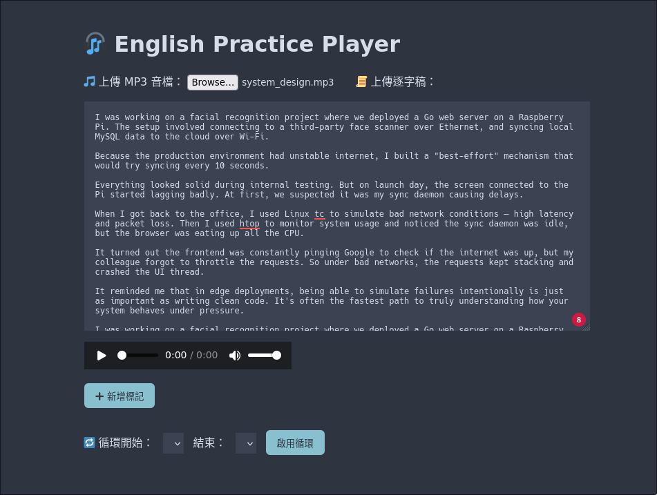

# 🎧 EchoLoop

> _Practice English by listening, looping, and echoing it back._

**EchoLoop** 是一個專為英文口說練習設計的純前端工具。你可以上傳 MP3 音檔與逐字稿，標記你想練習的時間點，並啟用循環播放功能，反覆練習難懂的句子，掌握每個語感節奏。

---

## 🚀 Live Demo

👉 [EchoLoop](https://jason9075.github.io/EchoLoop/)

---

## ✨ 特色功能

- 🎵 上傳任意 MP3 音檔
- 📝 貼上逐字稿，自由對照
- ⏱️ 任意時間點標記，快速跳轉
- 🔁 選取片段循環播放
- ❌ 管理標記（新增 / 刪除）
- 📏 即時顯示循環時間與錯誤提示

---

## 🚀 使用方式

1. 開啟 `index.html` 即可使用，無需安裝任何後端服務。
2. 上傳 MP3 音檔並貼上逐字稿。
3. 播放音檔 → 點擊「新增標記」。
4. 可從任一標記跳轉播放，或啟用循環練習片段。
5. 逐字稿區高度已擴充，便於對照閱讀。

---

## 📸 截圖（可放上你的畫面截圖）

---

## 🧪 開發者筆記

這是一個用 **vibe coding** 方式打造的練習專案。  
靈感來自語言學習者的每日口說反覆練習，  
你也可以自由 fork 改寫屬於自己的 EchoLoop。

---

## 📄 License

MIT License.  
Feel free to remix.

---

Made with ❤️ by Jason Kuan
